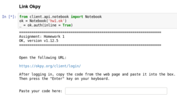
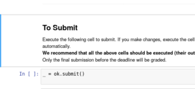

Homeworks 
=========

This page contains a list of links to PHY188/288 homeworks.

You can also access assignments from a link posted on the  bCourses website,  under “Assignments",
which contains the most updated information. 

 - **Python Tutorial**: 
  &nbsp; &nbsp; [Intro to Python](https://nbviewer.jupyter.org/github/phy188-288-ucb/seljak-fall-2019/blob/master/Homework/PythonTutorial/IntrotoPython.ipynb) (source:  https://github.com/berkeley-physics/intro_python)
 - **HW1 (Numerical Integration and ODE/PDEs)**: 
   &nbsp; &nbsp; [Physics 188](https://nbviewer.jupyter.org/github/phy188-288-ucb/seljak-fall-2019/blob/master/Homework/HW1/HW1_188.ipynb)/    [Physics 288](https://nbviewer.jupyter.org/github/phy188-288-ucb/seljak-fall-2019/blob/master/Homework/HW1/HW1_288.ipynb)
 - **HW2 (Intro to Statistics)**: 
   &nbsp; &nbsp; [Physics 188](https://nbviewer.jupyter.org/github/phy188-288-ucb/seljak-fall-2019/blob/master/Homework/HW2/HW2_188.ipynb)/    [Physics 288](https://nbviewer.jupyter.org/github/phy188-288-ucb/seljak-fall-2019/blob/master/Homework/HW2/HW2_288.ipynb)
 - **HW3 (Intro to Data Analysis, Dimensionality Reduction, and Clustering)**: 
   &nbsp; &nbsp; [Physics 188](https://nbviewer.jupyter.org/github/phy188-288-ucb/seljak-fall-2019/blob/master/Homework/HW3/HW3_188.ipynb)/    [Physics 288](https://nbviewer.jupyter.org/github/phy188-288-ucb/seljak-fall-2019/blob/master/Homework/HW3/HW3_288.ipynb)
 - **HW4 (Linear Algebra - Gaussian Elimination, SVD, Polynomial Regression, PCA, KNN, and Data Modeling)**: 
   &nbsp; &nbsp; [Physics 188](https://nbviewer.jupyter.org/github/phy188-288-ucb/seljak-fall-2019/blob/master/Homework/HW4/HW4_188.ipynb)/    [Physics 288](https://nbviewer.jupyter.org/github/phy188-288-ucb/seljak-fall-2019/blob/master/Homework/HW4/HW4_288.ipynb)
 - **HW5 (Fisher Information Matrix & Independent Component Analysis)**: 
   &nbsp; &nbsp; [Physics 188](https://nbviewer.jupyter.org/github/phy188-288-ucb/seljak-fall-2019/blob/master/Homework/HW5/HW5_188.ipynb)/    [Physics 288](https://nbviewer.jupyter.org/github/phy188-288-ucb/seljak-fall-2019/blob/master/Homework/HW5/HW5_288.ipynb)
 - **Project1-Part1 (Planck analysis I - Linear Algebra & Optimization)**: 
   &nbsp; &nbsp; [Physics 188](https://nbviewer.jupyter.org/github/phy188-288-ucb/seljak-fall-2019/blob/master/Homework/Project1_part1/Project1_part1_188.ipynb)/    [Physics 288](https://nbviewer.jupyter.org/github/phy188-288-ucb/seljak-fall-2019/blob/master/Homework/Project1_part1/Project1_part1_288.ipynb)
 - **Project1-Part2 (Planck analysis II - Bayesfast & Markov Chain Monte Carlo)**: 
   &nbsp; &nbsp; [Physics 188](https://nbviewer.jupyter.org/github/phy188-288-ucb/seljak-fall-2019/blob/master/Homework/Project1_part2/Project1_p2_188.ipynb)/    [Physics 288](https://nbviewer.jupyter.org/github/phy188-288-ucb/seljak-fall-2019/blob/master/Homework/Project1_part2/Project1_p2_288.ipynb)
 - **HW6 (Markov Chain Simulation and Hierarchical Model)**: 
   &nbsp; &nbsp; [Physics 188](https://nbviewer.jupyter.org/github/phy188-288-ucb/seljak-fall-2019/blob/master/Homework/HW6/HW6_188.ipynb)/    [Physics 288](https://nbviewer.jupyter.org/github/phy188-288-ucb/seljak-fall-2019/blob/master/Homework/HW6/HW6_288.ipynb)
 - **HW7 (Distributional Approximation, Expectation Maximization (EM), Interpolation and Resampling Methods)**: 
   &nbsp; &nbsp; [Physics 188](https://nbviewer.jupyter.org/github/phy188-288-ucb/seljak-fall-2019/blob/master/Homework/HW7/HW7_188.ipynb)/    [Physics 288](https://nbviewer.jupyter.org/github/phy188-288-ucb/seljak-fall-2019/blob/master/Homework/HW7/HW7_288.ipynb)
 - **HW8 part 1 (VI, EL2O, Generative Models, Multimodal Posteriors, and Gaussian Processes)**: 
   &nbsp; &nbsp; [Physics 188](https://nbviewer.jupyter.org/github/phy188-288-ucb/seljak-fall-2019/blob/master/Homework/HW8/notebooks/HW8_188.ipynb)/    [Physics 288](https://nbviewer.jupyter.org/github/phy188-288-ucb/seljak-fall-2019/blob/master/Homework/HW8/notebooks/HW8_288.ipynb)
 - **Project 2 (LIGO analysis - Fourier methods, Matched Filtering, and Differential Equations)**: 
   &nbsp; &nbsp; [Physics 188](https://nbviewer.jupyter.org/github/phy188-288-ucb/seljak-fall-2019/blob/master/Homework/Project2/Project2_188.ipynb)/    [Physics 288](https://nbviewer.jupyter.org/github/phy188-288-ucb/seljak-fall-2019/blob/master/Homework/Project2/Project2_288.ipynb)
 - **HW8 part 2 (Linear Regression, Regularization, and Logistic & Softmax Regression)**: 
   &nbsp; &nbsp; [Physics 188](https://nbviewer.jupyter.org/github/phy188-288-ucb/seljak-fall-2019/blob/master/Homework/HW8_p2/HW8_p2_188.ipynb)/    [Physics 288](https://nbviewer.jupyter.org/github/phy188-288-ucb/seljak-fall-2019/blob/master/Homework/HW8_p2/HW8_p2_288.ipynb)
 - **Project 3 (Final) (Classification and inference with machine learning)**: 
   &nbsp; &nbsp; [Physics 188](https://nbviewer.jupyter.org/github/phy188-288-ucb/seljak-fall-2019/blob/master/Homework/Project3/Project3_188.ipynb)/    [Physics 288](https://nbviewer.jupyter.org/github/phy188-288-ucb/seljak-fall-2019/blob/master/Homework/Project3/Project3_288.ipynb)

<!-- - HW1 (due Sept 4, 11:59pm): [Undergraduate_level](http://datahub.berkeley.edu/user-redirect/interact?account=phy151-ucb&repo=seljak-phy151-fall-2018&branch=master&path=Homework/HW1/HW1_U.ipynb)/    [Graduate_level](http://datahub.berkeley.edu/user-redirect/interact?account=phy151-ucb&repo=seljak-phy151-fall-2018&branch=master&path=Homework/HW1/HW1_G.ipynb)
 - HW2 (due Sept 10, 11:59pm): [Undergraduate_level](http://datahub.berkeley.edu/user-redirect/interact?account=phy151-ucb&repo=seljak-phy151-fall-2018&branch=master&path=Homework/HW2/HW2_U.ipynb)/    [Graduate_level](http://datahub.berkeley.edu/user-redirect/interact?account=phy151-ucb&repo=seljak-phy151-fall-2018&branch=master&path=Homework/HW2/HW2_G.ipynb) 
 - HW3 (due Sept 17, 11:59pm): [Undergraduate_level](http://datahub.berkeley.edu/user-redirect/interact?account=phy151-ucb&repo=seljak-phy151-fall-2018&branch=master&path=Homework/HW3/HW3_U.ipynb)/    [Graduate_level](http://datahub.berkeley.edu/user-redirect/interact?account=phy151-ucb&repo=seljak-phy151-fall-2018&branch=master&path=Homework/HW3/HW3_G.ipynb) 
 - HW4 (due Sept 26, 11:59pm): [Undergraduate_level](http://datahub.berkeley.edu/user-redirect/interact?account=phy151-ucb&repo=seljak-phy151-fall-2018&branch=master&path=Homework/HW4/HW4_U.ipynb)/    [Graduate_level](http://datahub.berkeley.edu/user-redirect/interact?account=phy151-ucb&repo=seljak-phy151-fall-2018&branch=master&path=Homework/HW4/HW4_G.ipynb) 
 - Project1-Part1 (due Oct 5, 11:59pm): [Undergraduate_level](http://datahub.berkeley.edu/user-redirect/interact?account=phy151-ucb&repo=seljak-phy151-fall-2018&branch=master&path=Homework/Project1_part1/Project1_p1_U.ipynb)/    [Graduate_level](http://datahub.berkeley.edu/user-redirect/interact?account=phy151-ucb&repo=seljak-phy151-fall-2018&branch=master&path=Homework/Project1_part1/Project1_p1_G.ipynb) 
 - Project1-Part2 (due Oct 12, 11:59pm): [Undergraduate_level](http://datahub.berkeley.edu/user-redirect/interact?account=phy151-ucb&repo=seljak-phy151-fall-2018&branch=master&path=Homework/Project1_part2/Project1_p2_U.ipynb)/    [Graduate_level](http://datahub.berkeley.edu/user-redirect/interact?account=phy151-ucb&repo=seljak-phy151-fall-2018&branch=master&path=Homework/Project1_part2/Project1_p2_G.ipynb) 
 - Project1-Part3 (due Oct 19, 11:59pm): [Undergraduate_level](http://datahub.berkeley.edu/user-redirect/interact?account=phy151-ucb&repo=seljak-phy151-fall-2018&branch=master&path=Homework/Project1_part3/Project1_p3_U.ipynb)/    [Graduate_level](http://datahub.berkeley.edu/user-redirect/interact?account=phy151-ucb&repo=seljak-phy151-fall-2018&branch=master&path=Homework/Project1_part3/Project1_p3_G.ipynb) 
 - HW5 (due Oct 26, 11:59pm): [Undergraduate_level](http://datahub.berkeley.edu/user-redirect/interact?account=phy151-ucb&repo=seljak-phy151-fall-2018&branch=master&path=Homework/HW5/HW5_U.ipynb)/    [Graduate_level](http://datahub.berkeley.edu/user-redirect/interact?account=phy151-ucb&repo=seljak-phy151-fall-2018&branch=master&path=Homework/HW5/HW5_G.ipynb) 
 - HW6 (due Nov 2, 11:59pm): [Undergraduate_level](http://datahub.berkeley.edu/user-redirect/interact?account=phy151-ucb&repo=seljak-phy151-fall-2018&branch=master&path=Homework/HW6/HW6_U.ipynb)/    [Graduate_level](http://datahub.berkeley.edu/user-redirect/interact?account=phy151-ucb&repo=seljak-phy151-fall-2018&branch=master&path=Homework/HW6/HW6_G.ipynb)
 - HW7 (due Nov 9, 11:59pm): [Undergraduate_level](http://datahub.berkeley.edu/user-redirect/interact?account=phy151-ucb&repo=seljak-phy151-fall-2018&branch=master&path=Homework/HW7/HW7_U.ipynb)/    [Graduate_level](http://datahub.berkeley.edu/user-redirect/interact?account=phy151-ucb&repo=seljak-phy151-fall-2018&branch=master&path=Homework/HW7/HW7_G.ipynb) 
 - Project2 (due Nov 26, 11:59pm): [Undergraduate_level](http://datahub.berkeley.edu/user-redirect/interact?account=phy151-ucb&repo=seljak-phy151-fall-2018&branch=master&path=Homework/Project2/Project2_U.ipynb)/    [Graduate_level](http://datahub.berkeley.edu/user-redirect/interact?account=phy151-ucb&repo=seljak-phy151-fall-2018&branch=master&path=Homework/Project2/Project2_G.ipynb) 
 - HW8 (due Dec 3, 11:59pm): [Undergraduate_level](http://datahub.berkeley.edu/user-redirect/interact?account=phy151-ucb&repo=seljak-phy151-fall-2018&branch=master&path=Homework/HW8/HW8_U.ipynb)/    [Graduate_level](http://datahub.berkeley.edu/user-redirect/interact?account=phy151-ucb&repo=seljak-phy151-fall-2018&branch=master&path=Homework/HW8/HW8_G.ipynb) 
 - Project3 (due Dec 14, 11:59pm): [Undergraduate_level](http://datahub.berkeley.edu/user-redirect/interact?account=phy151-ucb&repo=seljak-phy151-fall-2018&branch=master&path=Homework/Project3/Project3_U.ipynb)/    [Graduate_level](http://datahub.berkeley.edu/user-redirect/interact?account=phy151-ucb&repo=seljak-phy151-fall-2018&branch=master&path=Homework/Project3/Project3_G.ipynb) >
 
<!-- - [HW1 (due Sept 5)](http://datahub.berkeley.edu/user-redirect/interact?account=bccp&repo=seljak-phy151-fall-2017&branch=master&path=Homework/HW1/HW1.ipynb)/  [Solution](http://datahub.berkeley.edu/user-redirect/interact?account=bccp&repo=seljak-phy151-fall-2017&branch=master&path=Homework/HW1/HW1-solution.ipynb)
 - [HW2 (due Sept 11)](http://datahub.berkeley.edu/user-redirect/interact?account=bccp&repo=seljak-phy151-fall-2017&branch=master&path=Homework/HW2/HW2.ipynb)/  [Solution](http://datahub.berkeley.edu/user-redirect/interact?account=bccp&repo=seljak-phy151-fall-2017&branch=master&path=Homework/HW2/HW2-solution.ipynb)
 - [HW3 (due Sept 18)](http://datahub.berkeley.edu/user-redirect/interact?account=bccp&repo=seljak-phy151-fall-2017&branch=master&path=Homework/HW3/HW3.ipynb)/  [Solution](http://datahub.berkeley.edu/user-redirect/interact?account=bccp&repo=seljak-phy151-fall-2017&branch=master&path=Homework/HW3/HW3-solution.ipynb)
 - [HW4 (due Sept 25)](http://datahub.berkeley.edu/user-redirect/interact?account=bccp&repo=seljak-phy151-fall-2017&branch=master&path=Homework/HW4/HW4.ipynb)/  [Solution](http://datahub.berkeley.edu/user-redirect/interact?account=bccp&repo=seljak-phy151-fall-2017&branch=master&path=Homework/HW4/HW4-solution.ipynb)
 - [HW5 (due Oct 2)](http://datahub.berkeley.edu/user-redirect/interact?account=bccp&repo=seljak-phy151-fall-2017&branch=master&path=Homework/HW5/HW5.ipynb)/  [Solution](http://datahub.berkeley.edu/user-redirect/interact?account=bccp&repo=seljak-phy151-fall-2017&branch=master&path=Homework/HW5/HW5-solution.ipynb)
 - [Project1 (due Oct 20)](http://datahub.berkeley.edu/user-redirect/interact?account=bccp&repo=seljak-phy151-fall-2017&branch=master&path=Homework/Project1/Project1.ipynb)/  [Solution](http://datahub.berkeley.edu/user-redirect/interact?account=bccp&repo=seljak-phy151-fall-2017&branch=master&path=Homework/Project1/Project1-solution.ipynb)
 - [HW6 (due Nov 1)](http://datahub.berkeley.edu/user-redirect/interact?account=bccp&repo=seljak-phy151-fall-2017&branch=master&path=Homework/HW6/HW6.ipynb)/  [Solution](http://datahub.berkeley.edu/user-redirect/interact?account=bccp&repo=seljak-phy151-fall-2017&branch=master&path=Homework/HW6/HW6-solution.ipynb)
 - [HW7 (due Nov 8)](http://datahub.berkeley.edu/user-redirect/interact?account=bccp&repo=seljak-phy151-fall-2017&branch=master&path=Homework/HW7/HW7.ipynb)/  [Solution](http://datahub.berkeley.edu/user-redirect/interact?account=bccp&repo=seljak-phy151-fall-2017&branch=master&path=Homework/HW7/HW7-solution.ipynb)
 - [HW8 (due Nov 15)](http://datahub.berkeley.edu/user-redirect/interact?account=bccp&repo=seljak-phy151-fall-2017&branch=master&path=Homework/HW8/HW8.ipynb)/  [Solution](http://datahub.berkeley.edu/user-redirect/interact?account=bccp&repo=seljak-phy151-fall-2017&branch=master&path=Homework/HW8/HW8-solution.ipynb)
 - [Project2 (due Nov 29)](http://datahub.berkeley.edu/user-redirect/interact?account=bccp&repo=seljak-phy151-fall-2017&branch=master&path=Homework/Project2/Project2.ipynb)/  [Solution](http://datahub.berkeley.edu/user-redirect/interact?account=bccp&repo=seljak-phy151-fall-2017&branch=master&path=Homework/Project2/Project2-solution.ipynb)
 - [Project3 (due Dec 13)](http://datahub.berkeley.edu/user-redirect/interact?account=bccp&repo=seljak-phy151-fall-2017&branch=master&path=Homework/Project3/Project3.ipynb) -->
<!-- - ``TO BE POSTED`` -->
<!-- - [HW2 ??? ??, 2017](http://datahub.berkeley.edu/user-redirect/interact?account=bccp&repo=seljak-phy151-fall-2017&branch=master&path=Homework/HW2/HW2.ipynb) -->
<!-- - [HW3 ??? ??, 2017](http://datahub.berkeley.edu/user-redirect/interact?account=bccp&repo=seljak-phy151-fall-2017&branch=master&path=Homework/HW3/HW3.ipynb) -->
<!-- - [HW4 ??? ??, 2017](http://datahub.berkeley.edu/user-redirect/interact?account=bccp&repo=seljak-phy151-fall-2017&branch=master&path=Homework/HW4/HW4.ipynb) -->

Instructions
------------
How to access the assignment and submit it to okpy:

During the course of PHY188/288, you will be writing and running the homeworks in the Data8
IPython Jupyter Notebook environment provided by ``datahub.berkeley.edu``.

Once you click the homework link, the environment will bring you to the Jupyter Notebook
file browser interface.

 - If login is requested, be sure to use your Berkeley account (``@berkeley.edu``).
 - The initial log in may give a false positive 500 error "Too many Redirections".
   Click on the ``Home`` link at the top of page will bring you to the correct place;
   Status of this error is tracked as an [Issue](https://github.com/berkeley-dsep-infra/datahub/issues/42).

In the file browser, open the main homework notebook (e.g. “HW1.ipynb”) to inspect and finish the homework.

 - Puzzled by the interface? Here is an instruction on [Notebook Basics](http://jupyter-notebook.readthedocs.io/en/latest/examples/Notebook/Notebook%20Basics.html)
 - You do not need to worry about the “tests” folder and .ok file. These are configuration files for the okpy submission system,
   documented at [ok client](https://github.com/Cal-CS-61A-Staff/ok-client)

You do need to login to the okpy submission system in order to submit the homework.
This is usually performed in the first cell of the notebook. Here is an example

Execute the first cell of the notebook (with ``Shift+Enter``) and make sure that you are successfully logged in.

Depending on how long it is since your last visit of the notebook, you may be prompted to paste your authorization code for OK client.

 - Follow the instruction from the cell output to obbtain the authorization code.
 - Usually you will be asked to log into [okpy](https://okpy.org/client/login/) with your berkeley email address (**@berkeley.edu**).
  Please do **NOT** use your other email (e.g. @gmail.com) account when logging in.

To finish your homework, carefully read the comments and make changes (define functions, make plots, fill in the blanks, etc).

The last cell (containts a line ``_ = ok.submit()``) will submit your notebook. Run it with ``Shift+Enter`` to submit or re-submit.
Here is an example

 - You can submit multiple times -- we only grade the lastest submission before the deadline.
 - The notebook can be saved to the Data8 system for the duration of the semester. This can be done by clicking the floppy disk (&#x1f4be;),
   or clicking File/Save and Checkpoint. Have you ever seen a floppy disk?
   
 
   
<!-- Past Assignments:
To download a Jupyter notebook, right click the link and save it as an .ipynb file.

<!-- - **HW1** (Numerical Integration and ODE/PDEs): [PDF](https://raw.githubusercontent.com/phy188-288-ucb/seljak-fall-2019/master/Homework/HW1.pdf)/  [Jupyter notebook](https://raw.githubusercontent.com/phy188-288-ucb/seljak-fall-2019/master/Homework/HW1.ipynb)
 
<!-- - **HW2** (Intro to Statistics): [PDF](https://raw.githubusercontent.com/phy188-288-ucb/seljak-fall-2019/master/Homework/HW2.pdf)/  [Jupyter notebook](https://raw.githubusercontent.com/phy188-288-ucb/seljak-fall-2019/master/Homework/HW2.ipynb)
 
<!-- - **HW3** (Intro to Statistics - Part 2): [PDF](https://raw.githubusercontent.com/phy188-288-ucb/seljak-fall-2019/master/Homework/HW3.pdf)/  [Jupyter notebook](https://raw.githubusercontent.com/phy188-288-ucb/seljak-fall-2019/master/Homework/HW3.ipynb)

<!-- - **HW4** (Linear Algebra and Data Modeling): [PDF](https://raw.githubusercontent.com/phy188-288-ucb/seljak-fall-2019/master/Homework/HW4.pdf)/  [Jupyter notebook](https://raw.githubusercontent.com/phy188-288-ucb/seljak-fall-2019/master/Homework/HW4.ipynb)

<!-- - **HW5** (Markov Chain Simulation and Hierarchical Model): [PDF](https://raw.githubusercontent.com/phy188-288-ucb/seljak-fall-2019/master/Homework/HW5.pdf)/  [Jupyter notebook](https://raw.githubusercontent.com/phy188-288-ucb/seljak-fall-2019/master/Homework/HW5.ipynb)
 
<!-- - **Project 1 - part 1** (Fisher Information Matrix): [PDF](https://raw.githubusercontent.com/phy188-288-ucb/seljak-fall-2019/master/Homework/Project1_p1.pdf)/  [Jupyter notebook](https://raw.githubusercontent.com/phy188-288-ucb/seljak-fall-2019/master/Homework/Project1_p1.ipynb)
 
<!-- - **Project 1 - part 2** (Linear Algebra and Optimization): [PDF](https://raw.githubusercontent.com/phy188-288-ucb/seljak-fall-2019/master/Homework/Project1_p2.pdf)/  [Jupyter notebook](https://raw.githubusercontent.com/phy188-288-ucb/seljak-fall-2019/master/Homework/Project1_p2.ipynb)
 
<!-- - **Project 1 - part 1** (Markov chain Monte Carlo): [PDF](https://raw.githubusercontent.com/phy188-288-ucb/seljak-fall-2019/master/Homework/Project1_p3.pdf)/  [Jupyter notebook](https://raw.githubusercontent.com/phy188-288-ucb/seljak-fall-2019/master/Homework/Project1_p3.ipynb)
 
<!-- - **HW6** (MLE, MCMC, Interpolation, Expectation Maximization (EM), and Resampling Methods): [PDF](https://raw.githubusercontent.com/phy188-288-ucb/seljak-fall-2019/master/Homework/HW6.pdf)/  [Jupyter notebook](https://raw.githubusercontent.com/phy188-288-ucb/seljak-fall-2019/master/Homework/HW6.ipynb)
 
<!-- - **HW7** (Distributional Approximation and Gaussian Processes): [PDF](https://raw.githubusercontent.com/phy188-288-ucb/seljak-fall-2019/master/Homework/HW7.pdf)/  [Jupyter notebook](https://raw.githubusercontent.com/phy188-288-ucb/seljak-fall-2019/master/Homework/HW7.ipynb)
 
<!-- - **Project 2** (Fourier methods, Matched Filtering, and Differential Equations): [PDF](https://raw.githubusercontent.com/phy188-288-ucb/seljak-fall-2019/master/Homework/Project2.pdf)/  [Jupyter notebook](https://raw.githubusercontent.com/phy188-288-ucb/seljak-fall-2019/master/Homework/Project2.ipynb)
 
<!-- - **HW8** (Linear Regression, Regularization, and Logistic & Softmax Regression): [PDF](https://raw.githubusercontent.com/phy188-288-ucb/seljak-fall-2019/master/Homework/HW8.pdf)/  [Jupyter notebook](https://raw.githubusercontent.com/phy188-288-ucb/seljak-fall-2019/master/Homework/HW8.ipynb)

<!-- - **Project 3** (Classification and inference with machine learning): [PDF](https://raw.githubusercontent.com/phy188-288-ucb/seljak-fall-2019/master/Homework/Project3.pdf)/  [Jupyter notebook](https://raw.githubusercontent.com/phy188-288-ucb/seljak-fall-2019/master/Homework/Project3.ipynb)

